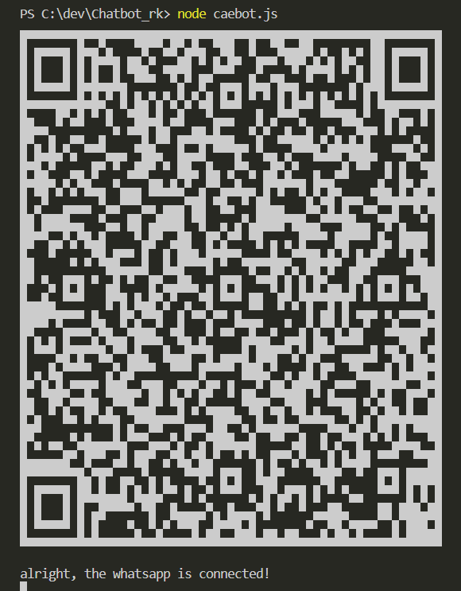

# ChatBotWhatsapp

This is a free and easily modifiable WhatsApp chatbot. To connect, simply scan the QR code with WhatsApp Web.

## Technologies Used

- [whatsapp-web.js](https://github.com/pedroslopez/whatsapp-web.js/): A library to interact with WhatsApp Web.
- [qr-code-terminal](https://github.com/gtaranuq/qr-code-terminal): Displays QR codes directly in the terminal to facilitate authentication.

> [!IMPORTANT]
> **It is not guaranteed you will not be blocked by using this method. WhatsApp does not allow bots or unofficial clients on their platform, so this shouldn't be considered totally safe.**


## How It Works

This chatbot has several trigger messages for activation. When a user sends an activation message to the user's private chat, the bot will send a greeting message and ask the user to choose one of the available options. Each selected option will result in a different response from the chatbot.

## Prerequisites

- Node.js
- NPM

## Installation

1. Clone this repository:

    ```bash
    git clone https://github.com/CaetanoLeal/ChatBotWhatsapp.git
    ```

2. Navigate to the project directory:

    ```bash
    cd ChatBotWhatsapp
    ```

3. Install the dependencies:

    ```bash
    npm install
    ```

## Usage

1. Run the bot:

    ```bash
    node Caebot.js
    ```

2. The QR code will be generated and displayed in the terminal when you run the command `node Caebot.js`. Scan the code with WhatsApp on your phone to authenticate.

3. After authentication, the bot will send a confirmation message in the terminal and will be ready to receive and respond to messages.



## Modifications

Feel free to make your modifications and use it as you wish! This is a demonstration code, so fork or clone the repository and create your own, more complex chatbot based on this one.
